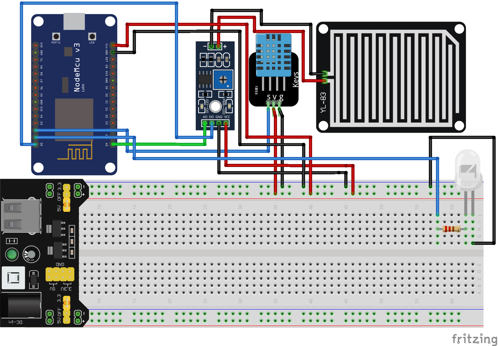

# ta-proposal-penelitian-arduino
Tugas Akhir Bahasa Indonesia - Proposal Individu - Semester 4

## Screenshot

## Parts Used

* NodeMCU V1.0
* Breadboard
* PE Breadboard Power Supply Module 3.3 5V MB102
* Resistor 220 ohm
* Rain Sensor
* DHT11 Sensor
* LED
* Jumper Cable
